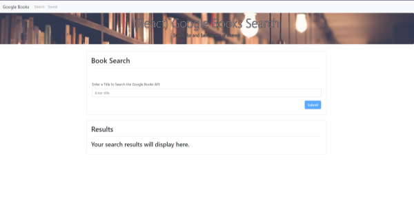
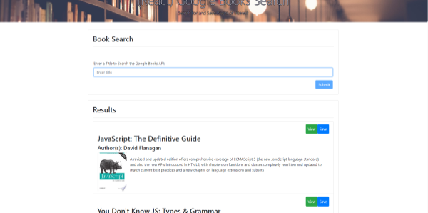
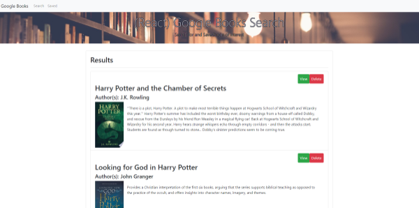

# (React) Google Books Search
A full-stack MERN application which searches the Google Books API and displays the results with buttons to click to either view a book at the Goolge Books URL or save that book to the database.  Clicking on the saved route in the navigation displays all of the books that have been saved in the database and allows the user to either view a particular book at the Google Books URL or delete that book from the database.

### Developed by: Sarah Kinneer
#### April, 2019

## Technologies Used:
MongoDB, Express, React, Node, Heroku, JavaScript, Mongoose

## Note:
I chose to use a very basic Bootstrap layout for this app as I was more concerned with functionality than beautification for this particular app.

## Check Out the Live Site:
- [Link to Live Site](https://sheltered-river-66171.herokuapp.com/)

## To Use:
1. Head to the live site at https://sheltered-river-66171.herokuapp.com/.

2. Enter your search terms and click submit to see the results.

3. Click the 'View' button to view a book in Google Books or click the 'Save' button to save a book to the database to view later.
4. Navigate to 'Saved' in the top navigation bar to view the books that have been saved to the database.

5. Click the 'View' button to view a book in Google Books or click the 'Delete' button to remove a book from the database.
6. Have fun searching the Google Books API!
